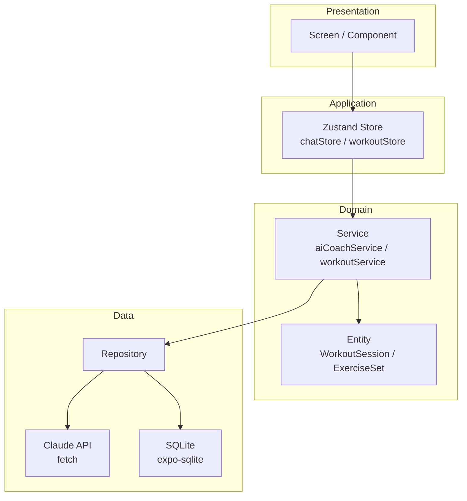

# 아키텍처 — workout_ai

> 작성: AI Agent 자동 생성 / 본인 검토 완료 (2026-05-18)
> 프레임워크: React Native (Expo) + TypeScript

## 전체 구조 다이어그램



## 레이어 설명

| 레이어 | 역할 | 주요 파일 위치 |
|---|---|---|
| **Presentation** | 화면 렌더링, 사용자 입력 처리 | `app/`, `components/` |
| **Application** | 상태관리, UI와 도메인 연결 | `store/` (Zustand) |
| **Domain** | 핵심 비즈니스 규칙, 엔티티 정의 | `services/`, `domain/entities/` |
| **Data** | 외부 데이터 접근 (Claude API, SQLite) | `data/api/`, `data/local/` |

## 디렉토리 구조

```
workout_ai/
├── app/                          # Expo Router (파일 기반 라우팅)
│   ├── _layout.tsx               # 루트 레이아웃, 하단 탭 네비게이션
│   ├── index.tsx                 # 홈 — 오늘의 운동 카드
│   ├── chat.tsx                  # AI 대화 화면
│   ├── record.tsx                # 운동 기록 입력
│   └── history.tsx               # 히스토리 조회
│
├── components/                   # 재사용 컴포넌트
│   ├── ChatBubble.tsx            # 말풍선
│   ├── WorkoutCard.tsx           # 루틴 카드
│   └── SetInputForm.tsx          # 세트/무게/횟수 입력
│
├── store/                        # Zustand 상태
│   ├── chatStore.ts              # 채팅 메시지, 로딩 상태
│   └── workoutStore.ts           # 운동 기록, 히스토리
│
├── services/                     # 비즈니스 로직
│   ├── aiCoachService.ts         # Claude API 프롬프트 구성, 응답 파싱
│   └── workoutService.ts         # 운동 기록 CRUD 로직
│
├── data/
│   ├── api/
│   │   └── claudeApiClient.ts    # fetch 기반 Claude API 호출
│   └── local/
│       └── database.ts           # expo-sqlite 초기화, 스키마, CRUD
│
├── domain/
│   └── entities/
│       ├── WorkoutSession.ts     # 운동 세션 타입
│       ├── ExerciseSet.ts        # 세트 기록 타입
│       └── Exercise.ts           # 종목 타입
│
├── .env                          # EXPO_PUBLIC_CLAUDE_API_KEY (gitignore)
├── .env.example                  # 키 없는 예시 파일
├── app.json                      # Expo 설정
└── package.json
```

## 주요 데이터 흐름

### 1. AI 운동 계획 요청
```
chat.tsx (사용자 입력)
  → chatStore.sendMessage()
  → aiCoachService.getWorkoutPlan(message, history)
  → claudeApiClient.call(prompt)
  → Claude API 응답
  → chatStore.messages 업데이트
  → chat.tsx (말풍선 렌더링)
```

### 2. 운동 기록 저장
```
record.tsx (세트/무게/횟수 입력)
  → workoutStore.saveSet()
  → workoutService.saveExerciseSet(set)
  → database.insertSet(set)
  → SQLite 저장 완료
```

## 기술 스택

| 항목 | 선택 | 이유 (ADR) |
|---|---|---|
| 프레임워크 | React Native (Expo) | ADR-0001 |
| 언어 | TypeScript | 타입 안전, AI 생성 코드 디버깅 유리 |
| 라우팅 | Expo Router | Expo 기본 제공, 파일 기반 직관적 |
| 상태관리 | Zustand | ADR-0003 |
| 로컬 저장소 | expo-sqlite | ADR-0002 |
| AI | Claude API (claude-haiku-4-5) | 비용 효율 |
| HTTP | fetch (내장) | 별도 패키지 불필요 |
