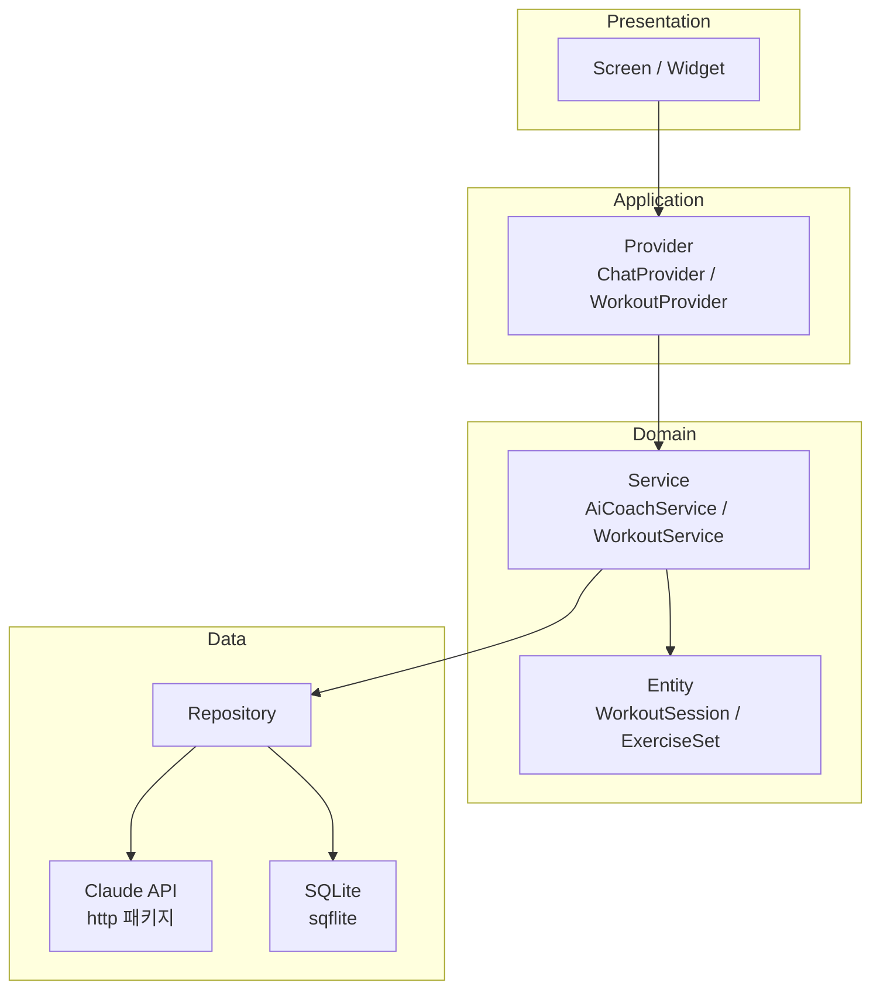

# 아키텍처 — workout_ai

> 프레임워크: Flutter (Dart) / 변경: 2026-06-01 (React Native → Flutter)

## 전체 구조 다이어그램



## 레이어 설명

| 레이어 | 역할 | 주요 위치 |
|---|---|---|
| **Presentation** | 화면 렌더링, 사용자 입력 | `lib/presentation/` |
| **Application** | 상태관리, UI-도메인 연결 | `lib/application/` (Provider) |
| **Domain** | 핵심 비즈니스 규칙, 엔티티 | `lib/domain/` |
| **Data** | 외부 접근 (Claude API, SQLite) | `lib/data/` |

## 디렉토리 구조

```
workout_ai/
├── lib/
│   ├── main.dart                     # 앱 진입점
│   ├── app.dart                      # MaterialApp, Provider 등록
│   │
│   ├── presentation/
│   │   ├── screens/
│   │   │   ├── home_screen.dart      # 홈 — 오늘의 운동 카드
│   │   │   ├── chat_screen.dart      # AI 대화 화면
│   │   │   ├── record_screen.dart    # 운동 기록 입력
│   │   │   └── history_screen.dart   # 히스토리 조회
│   │   └── widgets/
│   │       ├── chat_bubble.dart      # 말풍선
│   │       ├── workout_card.dart     # 루틴 카드
│   │       └── set_input_form.dart   # 세트/무게/횟수 입력
│   │
│   ├── application/
│   │   ├── chat_provider.dart        # 채팅 상태, API 호출 트리거
│   │   └── workout_provider.dart     # 운동 기록 상태, DB 연동
│   │
│   ├── domain/
│   │   ├── entities/
│   │   │   ├── workout_session.dart  # 운동 세션 모델
│   │   │   ├── exercise_set.dart     # 세트 기록 모델
│   │   │   └── chat_message.dart     # 채팅 메시지 모델
│   │   └── services/
│   │       ├── ai_coach_service.dart # Claude API 프롬프트 구성
│   │       └── workout_service.dart  # 운동 CRUD 로직
│   │
│   └── data/
│       ├── api/
│       │   └── claude_api_client.dart  # http 기반 Claude API 호출
│       └── local/
│           └── database.dart           # sqflite 초기화, 스키마, CRUD
│
├── assets/                           # 이미지, 아이콘
├── .env                              # CLAUDE_API_KEY (gitignore)
├── .env.example
├── pubspec.yaml                      # Flutter 의존성
└── android/                          # Android 빌드 설정
```

## 주요 데이터 흐름

### 1. AI 운동 계획 요청
```
ChatScreen (사용자 입력)
  → ChatProvider.sendMessage()
  → AiCoachService.getWorkoutPlan(messages, history)
  → ClaudeApiClient.call(prompt)
  → Claude API 응답
  → ChatProvider.messages 업데이트
  → ChatScreen (말풍선 렌더링)
```

### 2. 운동 기록 저장
```
RecordScreen (세트/무게/횟수 입력)
  → WorkoutProvider.saveSet()
  → WorkoutService.saveExerciseSet(set)
  → database.insertSet(set)
  → SQLite 저장 완료
```

## 기술 스택

| 항목 | 선택 | 이유 (ADR) |
|---|---|---|
| 프레임워크 | Flutter 3.44.0 (Dart) | ADR-0001 |
| 상태관리 | Provider | ADR-0003 |
| 로컬 저장소 | sqflite | ADR-0002 |
| AI | Claude API (claude-haiku-4-5) | 비용 효율 |
| HTTP | http 패키지 | Flutter 표준 |
